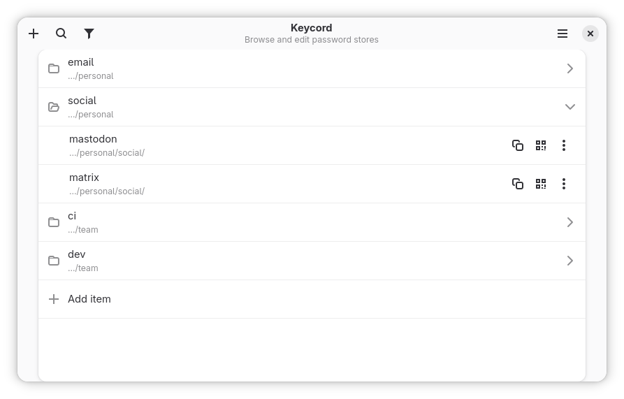
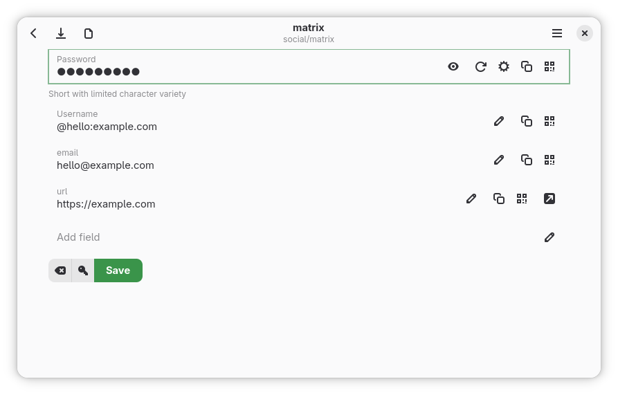

# Getting Started

Keycord is a graphical app for standard `pass` stores. You do not need to convert your data, and the interface is designed for keyboard, mouse, and touch across desktop and mobile devices.

## Core Concepts

### Store

A store is a directory with encrypted `pass` files and a `.gpg-id` file. If nothing else is configured, Keycord looks for `~/.password-store`.

You can add more than one store. Search spans all configured stores.

### Pass file

The first line is the password. Later lines can be structured fields:

```text
correct-horse-battery-staple
username: alice@example.com
email: alice@example.com
url: https://github.com/login
notes: personal account
```

Keycord treats these lines specially:

- `username:`, `user:`, and `login:` map to the username field
- `otpauth://...` or `otpauth: otpauth://...` becomes the OTP field
- other `key: value` lines become searchable fields
- lines without a colon are preserved as raw text but are not structured search fields
`pass` encrypts the complete entry as a `.gpg` file, just like its password line and other
fields. Treat the raw or otherwise decrypted entry as secret.

### Editors

- Standard editor: password, username, OTP, and dynamic fields
- Raw editor: the full pass file as text; in builds with passkey support, it is unavailable for recognized passkey entries

## Backends

Keycord has two backends:

- `Integrated`: reads and writes the store directly
- `Host`: runs your configured `pass` command

Use `Host` when you need:

- restore-from-Git
- `pass import`
- a custom `pass` command

These Host features are available on Linux only. If Host features are disabled in Flatpak, see [Permissions and Backends](permissions-and-backends.md).

## Quick Start

### 1. Add a store

Open Preferences with `Ctrl+,`.

- Add an existing `pass` store if you already have one.
- Choose an empty folder if you want a new store.

A new store needs at least one recipient before it is usable.


### 2. Pick a backend

Use `Integrated` unless you need Linux-only Host features.

### 3. Create an item

Press `Ctrl+N` and enter a path such as:

```text
personal/github
```

Keycord creates a new pass file from the current new-password template.

### 4. Edit and save

Fill in the fields you need:

- password
- username
- email
- URL
- notes
- OTP secret

Save with `Ctrl+S`.





### 5. Search

Press `Ctrl+F`.

Start with plain search:

```text
github
```

Then try structured search:

```text
find user alice
find url contains github
find email is $username
```

See [Search Guide](search.md) for the full syntax.

### 6. Open Tools

Press `Ctrl+T`.

Common tools:

- **Browse field values**
- **Find weak passwords**
- **Import passwords** on Linux when Host and `pass import` are available

For the built-in guides, open **Docs** from the main menu or press `Ctrl+Shift+D`.

## New Store

When you create a new store in an empty folder:

1. choose the folder in **Password Stores**
2. open **Store keys**
3. add at least one recipient
4. save the recipients

Keycord writes `.gpg-id`. If the store has no Git metadata, Keycord also initializes a Git repository.

## Restore From Git

**Restore password store** is a Linux-only Host feature.

Requirements:

- Linux build
- Host backend
- host access in Flatpak
- a local destination folder
- a Git repository URL

Steps:

1. open **Password Stores**
2. choose **Restore password store**
3. pick the folder
4. enter the repository URL

## Start With A Query

Keycord uses all command-line arguments as the initial search query.

Examples:

```sh
keycord github
keycord find user alice
keycord 'reg:(?i)^work/.+github$'
```

## Next

- [Search Guide](search.md)
- [Workflows](workflows.md)
- [Permissions and Backends](permissions-and-backends.md)

## Sharing passkeys with Android Password Store

Builds with the optional `passkey` feature use the existing storage format of
[Android Password Store (agrahn)](https://github.com/agrahn/Android-Password-Store).
The same Git-backed store and OpenPGP recipients can be used in both apps.

A passkey entry stores unpadded Base64URL-encoded CBOR on its first line before OpenPGP encryption.
Its immediate parent folder is the relying-party ID (for example, `example.com`),
and its filename is the full 32-byte credential ID in hexadecimal followed by `.gpg`.
New imports use `passkeys/<rp-id>/<credential-id>.gpg`. Keep the RP folder and
credential filename intact when moving entries. Keycord recognizes ES256, Ed25519,
and RSA-2048 RS256 credentials. Editing additional fields, OTP data, or notes
preserves the original passkey payload, including Android metadata.

Open a supported CXF JSON file to import an existing credential. Imports must have
a 32-byte credential ID and a supported private key; RSA imports require exponent
65537. FIDO2 extensions that Android cannot store are rejected. Importing a
credential does not register it with a website. CXP export requests can still be
inspected, but Keycord does not generate response archives.

Recognized passkey material is excluded from password copying, QR codes, CSV
exports, search fields, and password analysis. The former `passkey:` JSON format
is unsupported.

## Passless and build choices

The two Cargo features are independent:

- `--no-default-features --features passkey`: Android Password Store only.
- `--no-default-features --features passless`: Passless only.
- `--no-default-features --features passkey,passless`: both formats.
- `--no-default-features`: no credential recognition or credential-exchange workflow.

`setup` and `flatpak` do not select a credential format; add the desired feature
explicitly. Existing packaged builds select `passkey`. Meson also offers separate
`passkey` (existing default: enabled) and `passless` (default: disabled) options;
use `-Dpasskey=false -Dpassless=true` for Passless only.

Passless stores raw binary CBOR, unlike Android's encoded first line. Keycord keeps
each entry in its original format and never creates synchronized copies or converts
existing entries. With both features enabled, CXF import offers a format choice,
defaulting to Android. With one feature, import uses that format automatically.

New Passless imports use `fido2/<rp-id>/<credential-id>.gpg`. Only P-256 and Ed25519
software keys can be imported for Passless; RSA is rejected. Existing Ed25519
algorithm identifiers `-8` and `-19` are supported. Imports retain the 32-byte ID
restriction and reject nonempty extensions. Missing Passless metadata defaults to
counter zero, current creation time, discoverable, and backup state `notEligible`.

Passless entries show account and website details. Their content is read-only;
notes, extra fields, OTP and raw editing are unavailable. Moving, valid renaming,
deleting and undo preserve the native bytes, including extension and backup data.

Passless performs desktop authentication. Configure its pass backend for the same
store and credential directory, with access to the matching OpenPGP key. Keycord's
integrated keyring is separate from the host GPG keyring. Use ordinary OpenPGP
recipient encryption for interoperability; Keycord's “require all keys” layering
is not understood by other apps. Neither app's browser integration is added to
Keycord by enabling these storage features.
