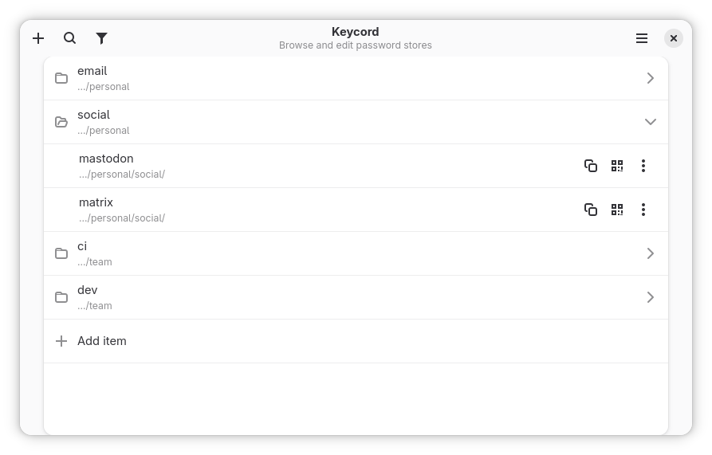
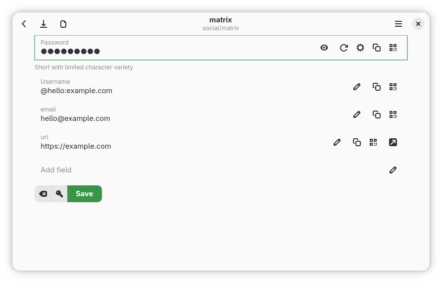

# Getting Started

Keycord is a graphical app for standard `pass` stores. You do not need to convert your data, and the interface is designed for keyboard, mouse, and touch across desktop and mobile devices.

## Core Concepts

### Store

A store is a directory with encrypted `pass` files and a `.gpg-id` file. If nothing else is configured, Keycord looks for `~/.password-store`.

You can add more than one store. Search spans all configured stores.

### Pass file

The first line is the password. Later lines can be structured fields:

```text
correct-horse-battery-staple
username: alice@example.com
email: alice@example.com
url: https://github.com/login
notes: personal account
```

Keycord treats these lines specially:

- `username:`, `user:`, and `login:` map to the username field
- `otpauth://...` or `otpauth: otpauth://...` becomes the OTP field
- `passkey: {"type":"passkey",...}` contains one compact standard CXF passkey JSON object
- other `key: value` lines become searchable fields
- lines without a colon are preserved as raw text but are not structured search fields
`pass` encrypts the complete entry as a `.gpg` file, just like its password line and other
fields. Treat the raw or otherwise decrypted entry as secret.

### Editors

- Standard editor: password, username, OTP, and dynamic fields
- Raw editor: the full pass file as text; it is unavailable for entries containing passkey material

### Passkeys

Keycord stores a passkey in an entry in the default `pass` store (normally `~/.password-store`) or another configured store; 
it does not use a separate passkey database. 
Opening a standard Credential Exchange Format (CXF) passkey file asks for confirmation, then prepares a new item in the default store for review and encrypted saving.
Keycord also recognizes and structurally checks local Credential Exchange Protocol (CXP) passkey export-request files when they are opened with the app.

This request-opening path is for local credential exchange. It does not make Keycord a browser
WebAuthn authenticator and does not by itself claim to have produced an encrypted CXP response.
Developers can leave this support out with `cargo build --no-default-features` or the Meson option
`-Dpasskey=false`.

## Backends

Keycord has two backends:

- `Integrated`: reads and writes the store directly
- `Host`: runs your configured `pass` command

Use `Host` when you need:

- restore-from-Git
- `pass import`
- a custom `pass` command

These Host features are available on Linux only. If Host features are disabled in Flatpak, see [Permissions and Backends](permissions-and-backends.md).

## Quick Start

### 1. Add a store

Open Preferences with `Ctrl+,`.

- Add an existing `pass` store if you already have one.
- Choose an empty folder if you want a new store.

A new store needs at least one recipient before it is usable.


### 2. Pick a backend

Use `Integrated` unless you need Linux-only Host features.

### 3. Create an item

Press `Ctrl+N` and enter a path such as:

```text
personal/github
```

Keycord creates a new pass file from the current new-password template.

### 4. Edit and save

Fill in the fields you need:

- password
- username
- email
- URL
- notes
- OTP secret

Save with `Ctrl+S`.





### 5. Search

Press `Ctrl+F`.

Start with plain search:

```text
github
```

Then try structured search:

```text
find user alice
find url contains github
find email is $username
```

See [Search Guide](search.md) for the full syntax.

### 6. Open Tools

Press `Ctrl+T`.

Common tools:

- **Browse field values**
- **Find weak passwords**
- **Import passwords** on Linux when Host and `pass import` are available

For the built-in guides, open **Docs** from the main menu or press `Ctrl+Shift+D`.

## New Store

When you create a new store in an empty folder:

1. choose the folder in **Password Stores**
2. open **Store keys**
3. add at least one recipient
4. save the recipients

Keycord writes `.gpg-id`. If the store has no Git metadata, Keycord also initializes a Git repository.

## Restore From Git

**Restore password store** is a Linux-only Host feature.

Requirements:

- Linux build
- Host backend
- host access in Flatpak
- a local destination folder
- a Git repository URL

Steps:

1. open **Password Stores**
2. choose **Restore password store**
3. pick the folder
4. enter the repository URL

## Start With A Query

Keycord uses all command-line arguments as the initial search query.

Examples:

```sh
keycord github
keycord find user alice
keycord 'reg:(?i)^work/.+github$'
```

## Next

- [Search Guide](search.md)
- [Workflows](workflows.md)
- [Permissions and Backends](permissions-and-backends.md)
